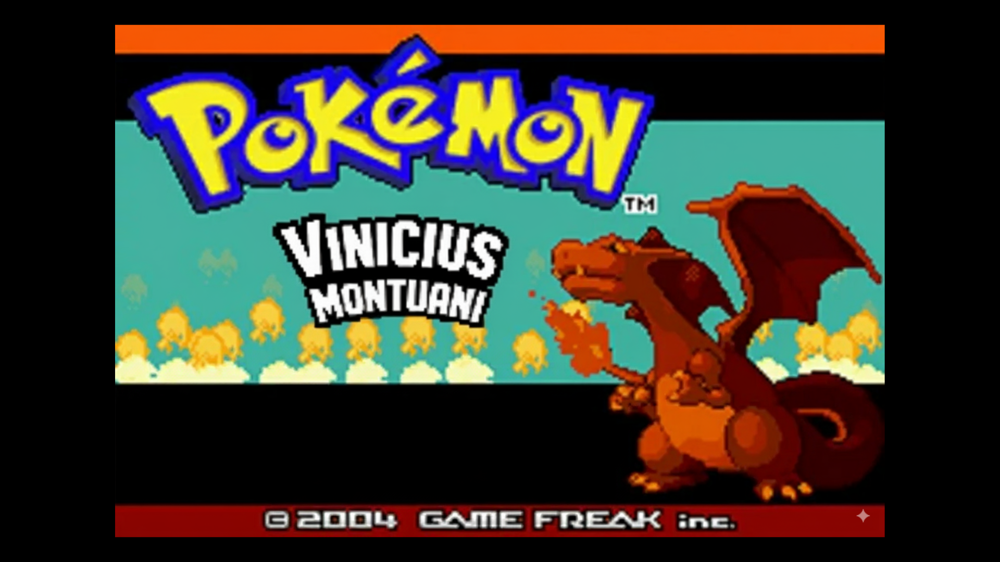

# Pokedex — Poke API!

## Status do Projeto

---

## Acesse a Pokedex Online!

Quer explorar o mundo Pokémon agora mesmo? Clique no botão abaixo e comece sua jornada!

---

## Sobre o Projeto

Este projeto é uma **Pokedex interativa** desenvolvida com a paixão de recriar a nostalgia dos jogos clássicos de Pokémon, como o lendário **Pokémon Fire Red**. Utilizando a poderosa **PokeAPI**, a Pokedex exibe informações detalhadas e precisas sobre seus Pokémon favoritos, oferecendo uma experiência imersiva e educativa sobre o tema de consumo de **APIs**.

Prepare-se para uma introdução cativante que evoca memórias dos seus primeiros passos no mundo Pokémon! Com a icônica **logo da Game Freak**, uma animação emocionante da **batalha de Gengar** e um nostálgico menu "Press Start", você será transportado diretamente para a experiência original dos jogos.

Nosso objetivo: Unir a nostalgia dos jogos clássicos com a modernidade das APIs para criar uma ferramenta de consulta Pokémon robusta e divertida!

---

## Tecnologias Utilizadas

Este projeto foi construído com as seguintes tecnologias web essenciais, garantindo uma aplicação robusta, interativa e com uma interface de usuário agradável:

  
  
  
  

*   **HTML5:** Estruturação semântica e acessível do conteúdo.
*   **CSS3:** Estilização moderna e responsiva para uma ótima experiência em qualquer dispositivo.
*   **JavaScript:** Interatividade dinâmica, consumo da PokeAPI e manipulação do DOM.
*   **Bootstrap:** Framework CSS para agilizar o desenvolvimento e garantir um design responsivo e consistente.

---

## Funcionalidades Principais

Descubra o que torna esta Pokedex especial:

*   **Introdução Imersiva (Fire Red Style):**
    Uma sequência de abertura cuidadosamente elaborada que homenageia Pokémon Fire Red. Inclui a logo da Game Freak, uma animação envolvente da batalha de Gengar e o clássico menu "Press Start", ativando sons nostálgicos para uma experiência completa!
    
    
    *Menu inspirado no Pokemon Fire Red clássico, com meu nome *

*   **Integração Poderosa com PokeAPI:**
    Busca e exibe dados completos de Pokémon em tempo real. Obtenha informações como:
    *   **Tipos:** Fogo, Água, Grama, etc.
    *   **Linha evolutiva:** Visualize a linha evolutiva do pokemon selecionado atualmente!
    *   **Estatísticas:** HP, Ataque, Defesa, Velocidade, etc.
    *   **Descrições:** Detalhes ricos sobre a biologia e comportamento de cada Pokémon.
    *   **Imagens:** Visualizações claras dos Pokémon.

*   **Funcionalidade "Random":**
    Descubra um Pokémon aleatório a qualquer momento! Perfeito para quem gosta de surpresas, está buscando inspiração para uma nova equipe ou simplesmente quer explorar o universo Pokémon sem um objetivo específico.
    

*   **Funcionalidade "Reset":**
    Com um único clique, retorne a Pokedex ao seu estado inicial, limpando todas as pesquisas e seleções. Conveniente para começar uma nova busca ou simplesmente recarregar a página de forma rápida.

---

## Como Usar

É simples embarcar nesta aventura Pokémon! Siga os passos:

1.  **Acesse a Pokedex:** Clique no link do GitHub Pages fornecido na seção "Acesse a Pokedex Online".
2.  **Introdução Nostálgica:** Assista à sequência de abertura inspirada em Pokémon Fire Red.
    *   **Importante:** Infelizmente, muitos navegadores bloqueiam a reprodução automática de áudio. Para desfrutar dos sons nostálgicos da introdução, **clique no GIF** ou em qualquer área da tela quando a página for carregada.
3.  **Inicie sua Jornada:** Pressione "Start" no menu principal para acessar a Pokedex.
4.  **Explore os Pokémon:**
    *   **Pesquise:** Utilize a barra de pesquisa para encontrar Pokémon por nome ou ID (número).
    *   **Aleatório:** Clique no botão **"Random"** para ser surpreendido com um Pokémon inesperado.
    *   **Reiniciar:** Use o botão **"Reset"** para limpar a visualização atual e começar uma nova busca.

---

## Como Contribuir (Opcional)

Este projeto foi desenvolvido como um estudo, mas sugestões e melhorias são sempre bem-vindas!

1.  Faça um Fork do projeto.
2.  Crie uma nova branch (`git checkout -b feature/minhaFeature`).
3.  Faça suas alterações e commit (`git commit -m 'feat: Minha nova feature'`).
4.  Envie para a branch original (`git push origin feature/minhaFeature`).
5.  Abra um Pull Request!

---

## Autor

Criado com dedicação e paixão por Pokémon por:

### Vinicius Montuani

